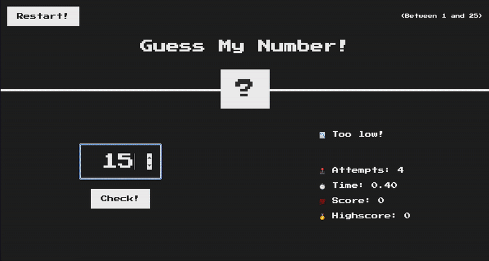

<div align="center"></div>

# Guess My Number

Jogo onde é preciso adivinhar o número secreto. Quanto menor o tempo e as tentativas utilizadas, maior a pontuação!

👉 Acesse o jogo em: **https://alexandresouva.github.io/guess-my-number**

---

## Indice

- [🕹️ Sobre o jogo](#sobre-o-jogo)
- [✅ Metodologias e Práticas Adotadas](#metodologias-e-práticas-adotadas)
- [🚀 Tecnologias e Stacks](#tecnologias-e-stacks)
- [🎯 Funcionalidades](#funcionalidades)
- [🛠️ Como rodar localmente](#como-rodar-localmente)

---

## 🕹️ Sobre o jogo

O objetivo é simples: **Adivinhar o número secreto entre 1 e 25.**

O jogo fornece dicas após cada tentativa:

- 📈 **"Too high"** (muito alto)
- 📉 **"Too low"** (muito baixo)

Ao acertar o número, o jogador recebe sua **pontuação** e pode comparar com o **recorde atual (highscore)**, representando o melhor desempenho obtido até o momento.

E você, consegue bater o recorde?

🕹️ [Jogue agora!](https://alexandresouva.github.io/guess-my-number)

---

## ✅ Metodologias e Práticas Adotadas

🔍 BDD (Behavior-Driven Development): Desenvolvimento guiado por comportamento, utilizando cenários de negócio claros para definir funcionalidades.

🧪 TDD (Test-Driven Development): Desenvolvimento orientado a testes, guiado pelas especificações obtidas com o BDD.

---

## 🚀 Tecnologias e Stacks

- ✅ **Angular 19** (Standalone APIs + Angular Signals)
- ✅ **BDD:** Cucumber + Gherkin + Cypress
- ✅ **TypeScript**
- ✅ **RxJS**
- ✅ **SCSS/CSS**
- ✅ **HTML Semântico**
- ✅ **Acessibilidade Web (ARIA aplicada)**
- ✅ **Testes unitários:** Karma + Jasmine
- ✅ **Cypress:** testes end-to-end
- ✅ **GitHub Actions:** CI/CD com deploy automático no GitHub Pages

---

## 🛠️ Funcionalidades

- 🎯 Adivinhe o número secreto
- ♻️ Reinicie o jogo
- ⏱️ Visualização do tempo gasto
- 🏆 Highscore salvo no navegador (localStorage)
- 🔊 Feedback acessível para leitores de tela
- 📱 **Responsivo para mobile, tablet e desktop**

---

## 🏗️ Como rodar localmente

### 1. Clone o repositório:

```bash
git clone https://github.com/alexandresouva/guess-my-number.git
cd guess-my-number
```

### 2. Instale as dependências:

```bash
npm install
```

### 3. Inicie o servidor:

```bash
npm start
```

Acesse o jogo em: **http://localhost:4200**

## Como testar

### 1. Instale as dependências:

```bash
npm install
```

### 2. Execute os testes unitários:

```bash
npm test
```

### 3. Execute os testes end-to-end:

```bash
npm run test:e2e
```

Se preferir, execute ng e2e para visualizar os testes end-to-end em tempo real.
