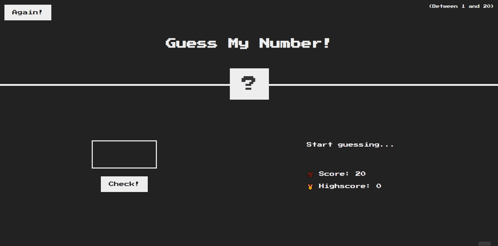

<h1 align="center">Guess My Number!</h1>

 <a href="#description">Descrição</a> •
 <a href="#stacks">Tecnologias</a> • 
 <a href="#updates">Atualizações</a> • 
 <a href="#deploy"><a href="https://alexandresouva.github.io/guess-my-number/" target="_blank"> Deploy (Git Hub Pages)</a></a>

<strong></strong> 

<h2 id="description">📑 Descrição do projeto</h2>

Jogo no qual o usuário tentará adivinhar um número aleatório entre 1 e 20. Quanto menos tentativas forem necessárias, maior a pontuação.

O objetivo é explorar conceitos de **manipulação de DOM** (JavaScript), utilização de **funções semânticas** e garantir uma boa UI, com uso de CSS.  

### Funcionalidades:

- Comparar o número digitado com o número aleatório gerado pelo programa;
- Apresentar dica ao usuário sobre o número digitado;
- Mudar a aparência da página caso o usuário vença;
- Botão para reiniciar o game;

<h2 id="stacks">👨‍💻 Tecnologias</h2>

**Front-end:** HTML, CSS e JavaScript (vanilla).

<h2 id="updates">📈 Atualizações futuras</h2>

Pretendo ainda implementar: 

- [ ] Adicionar um modal com instruções do jogo;
- [ ] Tonar o jogo responsivo;

<h2 id="deploy">📈 Deploy</h2>

Disponível no <a href="https://alexandresouva.github.io/guess-my-number/" target="_blank">Git Hub Pages.</a>
